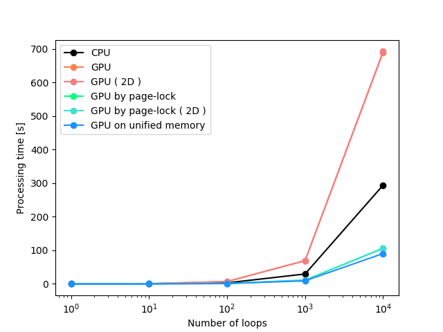

# _Outline_
This tool is for testing of image processing, assuming a situation of system that an image frame will be transfered from sensor to server.
The inner processes works, in order, allocation of host and device memory ( only a shared memory when `-u` option inputted ), frame acquisition, data transfer from host to device ( except `-u` option has inputted ), image process on the device memory ( only a shared memory when `-u` option inputted ), data transfer from device to host ( except `-u` option has inputted ) and free host and device memory ( only the shared memory when `-u` option inputted ). The loop processing works from the frame acquisition to the data transfer ( from device to host ).

# _Build_
```
git clone git@github.com:cetusk/cuda-checker.git
cd cuda-checker
mkdir build
cd build
cmake -D CMAKE_BUILD_TYPE=Release ..
make
```

# _Usage_
First you have to change `bin` directory, and can try it.
```
    # CPU
    ./cuda-checker -v -r 4K -N 1000
    # GPU
    ./cuda-checker -v -r 4K -N 1000 -c    -B 2560
    # GPU ( 2D )
    ./cuda-checker -v -r 4K -N 1000 -c    -B  640 4
    # GPU ( page-lock )
    ./cuda-checker -v -r 4K -N 1000 -c -p -B 2560
    # GPU ( page-lock, 2D )
    ./cuda-checker -v -r 4K -N 1000 -c -p -B  640 4
    # GPU ( unified memory )
    ./cuda-checker -v -r 4K -N 1000 -c -u -B 2560
```

# _Options_
```
    -h | --help           : Help options.
    -v | --verbose        : Debug logs.
    -c | --cuda           : Use CUDA computing.
    -p | --page-lock      : Use page-locked memory.
    -u | --unified-memory : Use unified memory system.
    -r | --resolution     : (QQVGA/QVGA/VGA/XGA/HD/FHD/2K/3K/4K/5K/6K/8K/10K/16K)
    -N | --num-loops      : (int value) Number of image processing loops.
    -W | --width          : (int value) Image width.
    -H | --height         : (int value) Image height.
    -B | --blocks         : (int value) Number of GPU blocks.
    -G | --grids          : (int value) Number of GPU grids.
```

# _Note_
- You can input multiple dimensions of GPU block/grid as `-B x y z` or `-G x y`, but this tool supportes until 2 dimension ( `z` value will be ignored ). In addition, because of CUDA API not support a multi dimensional allocation for the unified memory system, when you input multi dimensions with `-u` option this tool works as 1 dimension by integrate higher dimensional value to `x` dimension.
- You can input explicit value of GPU block and grid. In usual, you should better for specifying only either one because the block/grid value is automatically derived based on a width, height, channels and grid/block.
- The priority of `-u/--unified-memory` is higher than `-p/--page-lock`, so if you input `-u` then `-p` will be disabled.

# _Sample benchmark_
